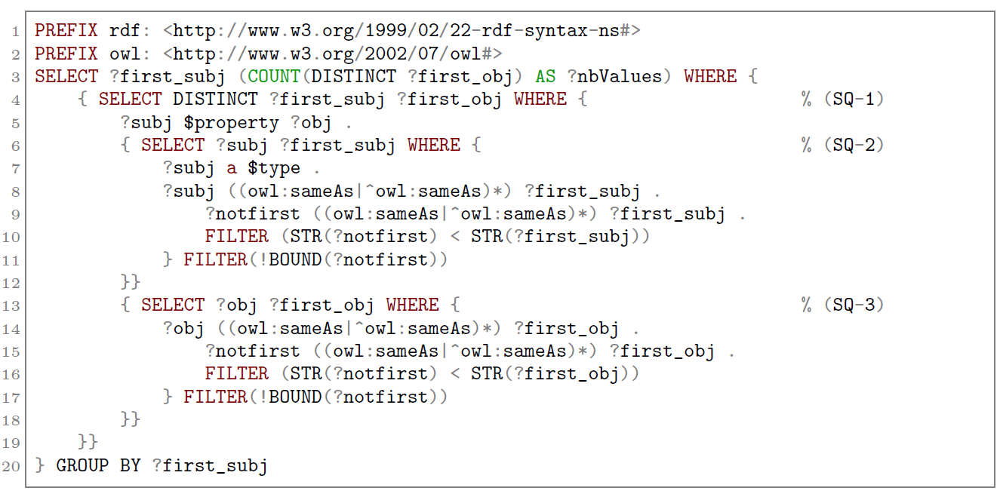
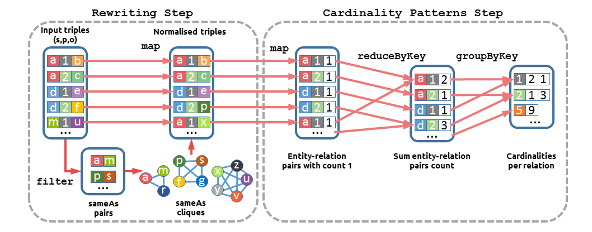
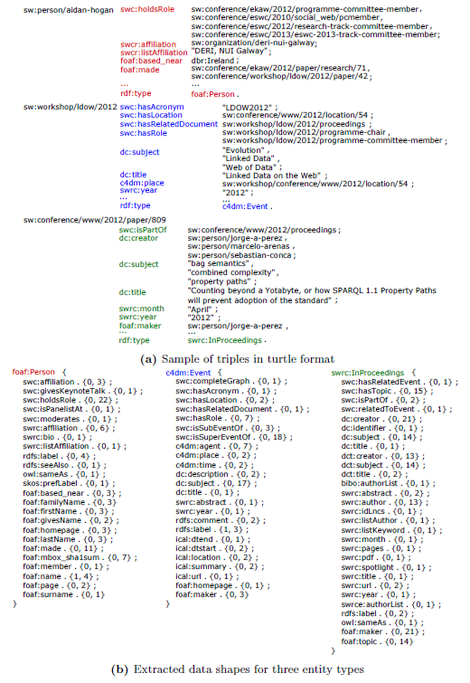

## Relation cardinality in Knowledge Bases

There is an increasing number of Semantic Web knowledge bases (KBs) available on the Web, generated in academia and industry alike. In this paper, we address the problem of lack of structure in these KBs due to their schema-free nature required for open environments such as the Web. We propose a definition for relation cardinality bounds that can be used to unveil the structure that KBs data naturally exhibit. Relation cardinality is an important structural aspect of data that has not received enough attention in the context of KBs. Information about relation cardinalities such as a person can have two parents and zero or more children, or a book should have one author at least, or a country should have more than two cities can be useful for data users and knowledge engineers when writing queries and reusing or engineering KB systems. Such cardinalities can be declared using OWL and RDF constraint languages as constraints on the usage of properties in the domain of knowledge; however, their declaration is optional and consistency with the instance data is not ensured. We first address the problem of mining relation cardinality bounds by proposing an algorithm that normalises and filters the data to ensure the accuracy and robustness of the mined cardinality bounds. Then we show how these bounds can be used to assess two relevant data quality dimensions: consistency and completeness. Finally, we report that relation cardinality bounds can also be used to expose structural characteristics of a KB by mapping the bounds into a constraint language to declare the actual shape of data.

In a nutshell, we try to solve the following problem:

| Relation Cardinality Mining Problem |
|-------------------------------------|
| ** Input: ** a knowledge base , and optional context  |
| ** Output: ** a set $$\Sigma$$ of relation cardinality bounds that are satisfied by . |

For addressing this problem, we propose an algorithm with to possible implementations. First, using SPARQL query language to generate a rather complex query, and second using Apache Spark[^1] with MapReduce.

### SPARQL implementation

### Spark implementation

## Datasets

1. [**LinkedMDB**](http://data.linkedmdb.org/)
	LinkedMDB is an open repository that describes movies, actors, directors, and so forth from the IMDB database.
2. [**OpenCyc**](http://www.cyc.com/platform/opencyc)
	OpenCyc is a large general KB released in 2012 that contains hundreds of thousands of terms in the domain of human knowledge covering places, organisations, business-related terms and people among others.
3. [**UOBM**](https://www.cs.ox.ac.uk/isg/tools/UOBMGenerator/)
	UOBM is a synthetic dataset that extends the Lehigh University Benchmark (LUMB), a university domain ontology, that contains information about faculties and students.
4. [**British National Library**](http://www.bl.uk/bibliographic/download.html)
	British National Library (BNL) is a dataset published by the National Library of the UK (second largest library in the world) about books and serials.
5. [**Mondial**](http://www.dbis.informatik.uni-goettingen.de/Mondial/#RDF)
	Mondial is a database compiled from geographical Web data sources such as CIA World Factbook, and Wikipedia.
6. [**New York Times People**](https://datahub.io/dataset/nytimes-linked-open-data)
	New York Times People is a compilation of the most authoritative people mentioned in news of the New York Times newspaper since 2009.
7. [**SWDF**](http://data.semanticweb.org/)
	SWDF is a small dataset containing information related to several semantic web related conferences and workshops.

The characteristics of the datasets are summarised in the table below.

| Dataset                  | Nb. Triples | Nb. Types | Nb. Prop. | Nb. sameAs |
|--------------------------|:-----------:|:---------:|:---------:|:----------:|
| LinkedMDB                |  3,579,532  |     41    |    148    |   92,589   |
| OpenCyc                  |  2,413,894  |   7,613   |    165    |   360,014  |
| UOBM                     |  2,217,286  |     40    |     29    |      0     |
| British National Library |   210,820   |     24    |     45    |   14,761   |
| Mondial                  |   186,534   |     27    |     60    |      0     |
| New York Times People    |   103,496   |     1     |     20    |   14,884   |
| SWDF                     |   101,321   |     62    |    132    |     759    |

## ShEx shapes schema

We propose a mapping of the relation cardinality bounds to the Shape Expressions (ShEx)[^2] constraint language. Such schema shapes can be used to validate the data in the knoweldge base.

## Publications

For more details, you can check our published work.

- Emir Muñoz, Matthias Nickles: Statistical Relation Cardinality Bounds in Knowledge Bases. TLDKS 2018 [in press]
- Emir Muñoz, Matthias Nickles: Mining Cardinalities from Knowledge Bases. DEXA (1) 2017: 447-462 [[Link]](https://link.springer.com/chapter/10.1007%2F978-3-319-64468-4_34)

[^1]: https://spark.apache.org/

[^2]: http://shex.io/
	More information about the language and a Scala implementation at http://labra.weso.es/shaclex/